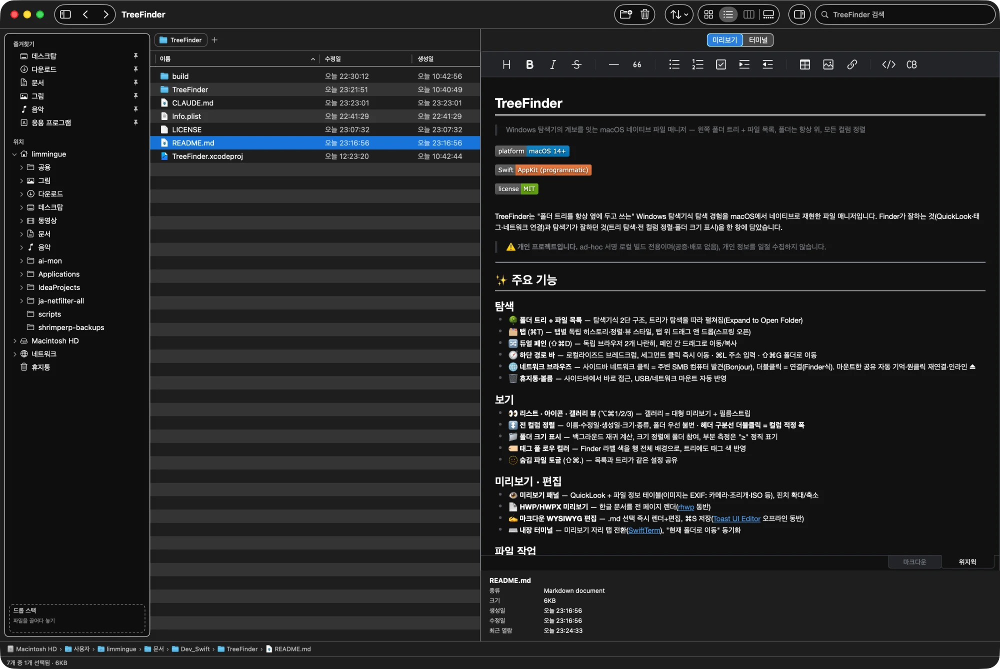
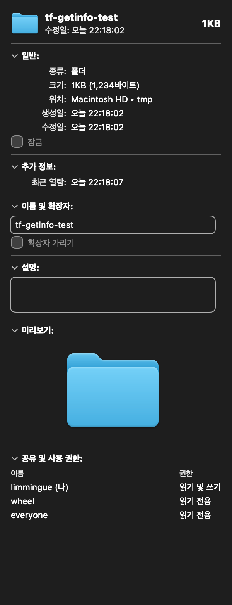

# TreeFinder

> Windows 탐색기의 계보를 잇는 macOS 네이티브 파일 매니저 — 왼쪽 폴더 트리 + 파일 목록, 폴더는 항상 위, 모든 컬럼 정렬


-orange)


TreeFinder는 "폴더 트리를 항상 옆에 두고 쓰는" Windows 탐색기식 탐색 경험을 macOS에서 네이티브로 재현한 파일 매니저입니다. Finder가 잘하는 것(QuickLook·태그·네트워크 연결)과 탐색기가 잘하던 것(트리 탐색·전 컬럼 정렬·폴더 크기 표시)을 한 창에 담았습니다.

> ⚠️ **개인 프로젝트입니다.** ad-hoc 서명 로컬 빌드 전용이며(공증·배포 없음), 개인 정보를 일절 수집하지 않습니다.



<p align="center"><sub>왼쪽부터: 즐겨찾기·위치(네트워크·휴지통 포함) 사이드바 트리 · 파일 목록 · 미리보기 패널(마크다운 WYSIWYG 렌더 + 파일 정보 테이블)</sub></p>

---

## 📸 스크린샷

**정보 가져오기 (⌘I)** — Finder식 정보 창. 폴더는 실측 크기(백그라운드 계산), 이미지는 EXIF, 권한 표까지 표시합니다.



---

## ✨ 주요 기능

### 탐색
- 🌳 **폴더 트리 + 파일 목록** — 탐색기식 2단 구조, 트리가 탐색을 따라 펼쳐짐(Expand to Open Folder)
- 🗂 **탭** (⌘T) — 탭별 독립 히스토리·정렬·뷰 스타일, 탭 위 드래그 앤 드롭(스프링 오픈)
- 🔀 **듀얼 페인** (⇧⌘D) — 독립 브라우저 2개 나란히, 페인 간 드래그로 이동/복사
- 🧭 **하단 경로 바** — 로컬라이즈드 브레드크럼, 세그먼트 클릭 즉시 이동 · ⌘L 주소 입력 · ⇧⌘G 폴더로 이동
- 🌐 **네트워크 브라우즈** — 사이드바 네트워크 클릭 = 주변 SMB 컴퓨터 발견(Bonjour), 더블클릭 = 연결(Finder식). 마운트한 공유 자동 기억·원클릭 재연결·인라인 ⏏
- 🗑 **휴지통·볼륨** — 사이드바에서 바로 접근, USB/네트워크 마운트 자동 반영

### 보기
- 👀 **리스트 · 아이콘 · 갤러리 뷰** (⌥⌘1/2/3) — 갤러리 = 대형 미리보기 + 필름스트립
- ↕️ **전 컬럼 정렬** — 이름·수정일·생성일·크기·종류, 폴더 우선 불변 · **헤더 구분선 더블클릭 = 컬럼 적정 폭**
- 📁 **폴더 크기 표시** — 백그라운드 재귀 계산, 크기 정렬에 폴더 참여, 부분 측정은 "≥" 정직 표기
- 🏷 **태그 풀 로우 컬러** — Finder 라벨 색을 행 전체 배경으로, 트리에도 태그 색 반영
- 🫥 **숨김 파일 토글** (⇧⌘.) — 목록과 트리가 같은 설정 공유

### 미리보기 · 편집
- 👁 **미리보기 패널** — QuickLook + 파일 정보 테이블(이미지는 EXIF: 카메라·조리개·ISO 등), 핀치 확대/축소
- 📄 **HWP/HWPX 미리보기** — 한글 문서를 전 페이지 렌더([rhwp](https://github.com/edwardkim/rhwp) 동반)
- ✍️ **마크다운 WYSIWYG 편집** — .md 선택 즉시 렌더+편집, ⌘S 저장([Toast UI Editor](https://ui.toast.com/tui-editor) 오프라인 동반)
- ⌨️ **내장 터미널** — 미리보기 자리 탭 전환([SwiftTerm](https://github.com/migueldeicaza/SwiftTerm)), "현재 폴더로 이동" 동기화

### 파일 작업
- 🧰 복사/이동/휴지통/복제/압축(zip)/인라인 이름 변경 — **Undo 지원**, 진행률 패널+취소, 덮어쓰기 없는 충돌 회피
- ♻️ **되돌려 놓기** — TreeFinder가 지운 파일을 원위치로 복원
- ℹ️ **정보 가져오기** (⌘I) — Finder식 정보 창(폴더 실측 크기·위치·EXIF·권한 표시)
- 📌 **Drop Stack** — 사이드바 임시 선반에 파일을 모아뒀다 목적지에서 일괄 이동/복사
- 🔤 **클립보드 NFC 보정** — 경로 복사 시 한글 자모 분리(ㅎㅏㄴㄱㅡㄹ) 방지

그 밖에: FSEvents 자동 새로고침 · 다크 모드 · 한국어/영어 · 검색 필터 · Open With · 공유 · Finder에 보기

---

## ⌨️ 주요 단축키

| 단축키 | 동작 | 단축키 | 동작 |
|---|---|---|---|
| ⌘T / ⌘W | 새 탭 / 탭 닫기 | ⌘I | 정보 가져오기 |
| ⌃⇥ / ⌘1…9 | 탭 전환 | ⌘R | 이름 변경 |
| ⇧⌘D | 듀얼 페인 | ⌘⌫ | 휴지통으로 이동 |
| ⌥⌘1/2/3 | 아이콘/리스트/갤러리 뷰 | ⇧⌘N | 새 폴더 |
| ⇧⌘. | 숨김 파일 표시 | ⌥⌘C | 경로 복사 (NFC 보정) |
| ⌘[ / ⌘] / ⌘↑ | 뒤로 / 앞으로 / 상위 폴더 | ⌘F | 검색 |
| ⌘L / ⇧⌘G | 주소 입력 / 폴더로 이동 | ⇧⌘P | 미리보기 패널 토글 |
| ⌘K | 서버에 연결 | ⌘, | 설정 |

---

## 🧰 요구사항

- **macOS 14.0 (Sonoma) 이상**, Apple Silicon / Intel (Universal)
- 빌드 시: **Xcode 15+** (SwiftTerm 패키지 해석과 Metal 툴체인이 필요해 Command Line Tools만으로는 부족합니다)

---

## 🛠️ 빌드 & 설치

```bash
git clone https://github.com/LimMinGue/TreeFinder.git
cd TreeFinder
xcodebuild -project TreeFinder.xcodeproj -scheme TreeFinder \
           -configuration Release -derivedDataPath build/dd build
```

빌드 후 응용 프로그램 폴더로 설치:

```bash
ditto build/dd/Build/Products/Release/TreeFinder.app /Applications/TreeFinder.app
open /Applications/TreeFinder.app
```

> `xcode-select`가 Command Line Tools를 가리키고 있다면 명령 앞에
> `DEVELOPER_DIR=/Applications/Xcode.app/Contents/Developer` 를 붙이세요.
>
> **Gatekeeper 안내**: ad-hoc 서명(미공증) 앱이라, 직접 빌드하지 않은 사본을 처음 열 때 경고가 뜨면 **우클릭 → "열기"** 로 실행하세요.

### 권한 안내
- **전체 디스크 접근**(선택): 휴지통 내용·일부 보호 폴더의 크기 측정에 필요 — 없으면 해당 항목은 "—"/"≥"로 정직하게 표시됩니다.
- **로컬 네트워크**(선택): 네트워크 보기에서 주변 컴퓨터를 찾는 데 사용합니다.

---

## 🏗️ 설계 노트

- **순수 AppKit 프로그래매틱 UI** — 스토리보드/XIB 없음(설정 화면만 SwiftUI Form)
- **외부 의존성 최소** — SPM 의존성은 SwiftTerm 하나. rhwp(HWP 렌더러 CLI)와 Toast UI Editor는 라이선스 고지와 함께 리소스로 동반
- **폴더 크기 = 단일 actor 소유** — 어떤 패널도 자체 스캔을 시작하지 않고 조회만(중복 스캔·TCC 프롬프트 폭주 방지), 값의 역행 없는 스트리밍 표시
- **파일 연산 엔진** — 백그라운드 실행 + 진행률 + 항목 경계 취소, 모든 조작에 Undo 등록
- **비샌드박스** — 범용 파일 매니저 특성상 샌드박스와 양립 불가. 네트워크 자격 증명은 앱이 저장하지 않고 전부 키체인에 위임

---

## 🧩 서드파티

| 구성 요소 | 용도 | 라이선스 |
|---|---|---|
| [SwiftTerm](https://github.com/migueldeicaza/SwiftTerm) | 내장 터미널 | MIT |
| [rhwp](https://github.com/edwardkim/rhwp) | HWP/HWPX 페이지 렌더(동반 CLI) | MIT |
| [Toast UI Editor](https://ui.toast.com/tui-editor) | 마크다운 WYSIWYG 편집 | MIT |

---

## 📄 라이선스

[MIT](LICENSE) © 2026 LimMinGue

버그 리포트 및 문의: iamwhatiam78@gmail.com
